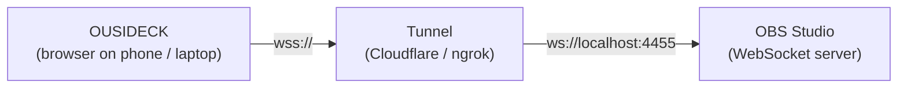

# OUSIDECK — Remote Control Panel for OBS

OUSIDECK is a web-based, customizable "stream deck" for [OBS Studio](https://obsproject.com/). Build a grid of buttons that switch scenes, show or hide sources, mute microphones, and start or stop recording and streaming — from your phone, tablet, or any other browser, anywhere.

This document is a step-by-step tutorial: by the end you will have OUSIDECK running and controlling your own OBS.

---

## Table of Contents

1. [Features](#features)
2. [How It Works](#how-it-works)
3. [Prerequisites](#prerequisites)
4. [Tutorial](#tutorial)
   - [Step 1 — Install the project](#step-1--install-the-project)
   - [Step 2 — Enable the OBS WebSocket server](#step-2--enable-the-obs-websocket-server)
   - [Step 3 — Expose OBS with a tunnel](#step-3--expose-obs-with-a-tunnel)
   - [Step 4 — Start OUSIDECK](#step-4--start-ousideck)
   - [Step 5 — Connect to OBS](#step-5--connect-to-obs)
   - [Step 6 — Build your deck](#step-6--build-your-deck)
   - [Step 7 — Use it live](#step-7--use-it-live)
5. [Key Action Reference](#key-action-reference)
6. [Deploying Online](#deploying-online)
7. [Project Structure](#project-structure)
8. [Extending OUSIDECK](#extending-ousideck)
9. [Security Notes](#security-notes)
10. [Troubleshooting](#troubleshooting)
11. [Tech Stack](#tech-stack)

---

## Features

- **Remote control** of OBS from any device with a browser.
- **Five action types**: switch scene, show/hide a source, mute/unmute an audio input, start/stop recording, start/stop streaming.
- **Live feedback**: keys light up when their action is active (current scene, visible source, recording, streaming).
- **Status bar** showing the current scene plus REC and LIVE indicators.
- **Custom layout**: add, edit, and delete keys with the built-in editor.
- **Persistent setup**: your connection details and keys are remembered in the browser.
- **No backend required**: the app talks to OBS directly from the browser.

## How It Works

OUSIDECK is a Next.js front-end that connects to OBS through the **OBS WebSocket (protocol v5)**. Because OBS normally runs on a private computer, a tunnel makes its WebSocket reachable from outside your network.



Once connected, OUSIDECK loads your scenes and sources, then listens to OBS events so the keys always reflect the real state of OBS.

## Prerequisites

| Requirement                                  | Notes                                                                                                                                                         |
| -------------------------------------------- | ------------------------------------------------------------------------------------------------------------------------------------------------------------- |
| **Node.js** 18.17 or newer                   | Required by Next.js 14. Node 20 or 22 is recommended.                                                                                                         |
| **npm**                                      | Installed together with Node.js.                                                                                                                              |
| **OBS Studio** 28 or newer                   | OBS WebSocket v5 is built in from version 28.                                                                                                                 |
| **A tunnel tool** _(only for remote access)_ | [Cloudflare Tunnel (`cloudflared`)](https://developers.cloudflare.com/cloudflare-one/connections/connect-networks/downloads/) or [ngrok](https://ngrok.com/). |

---

## Tutorial

### Step 1 — Install the project

```bash
# 1. Go into the project folder
cd OUSIDECK

# 2. Install dependencies
npm install
```

> **Note:** OUSIDECK does not need any environment variables. If your copy contains a `.env` file, the app does not read it — you can safely ignore it (and never commit it).

### Step 2 — Enable the OBS WebSocket server

1. Open **OBS Studio**.
2. Go to **Tools → WebSocket Server Settings**.
3. Tick **Enable WebSocket server**.
4. Keep the default **Server Port** (`4455`), or note it if you change it.
5. Tick **Enable Authentication**, then set a **Server Password** (use **Generate Password** if you like).
6. Click **Apply** and **OK**.

Keep OBS running while you use OUSIDECK.

### Step 3 — Expose OBS with a tunnel

> **Controlling OBS from the same computer?** You can skip this step and use `ws://localhost:4455` as the address in Step 5. A tunnel is needed when you want to control OBS from another device or over the internet.

**Install `cloudflared`:**

```bash
# Windows
winget install --id Cloudflare.cloudflared

# macOS
brew install cloudflared

# Linux: see the download page linked in Prerequisites
```

**Start a quick tunnel that points to the OBS WebSocket port:**

```bash
cloudflared tunnel --url http://localhost:4455
```

After a few seconds it prints an address like:

```
https://random-words-1234.trycloudflare.com
```

Convert it to a WebSocket address by replacing `https://` with `wss://`:

```
wss://random-words-1234.trycloudflare.com
```

This `wss://` address is what you enter in OUSIDECK.

> **Important:** quick tunnels get a **new random address every time you restart them**. Keep the terminal open during your session, and update the address in OUSIDECK if you restart the tunnel.

<details>
<summary>Prefer ngrok?</summary>

```bash
ngrok http 4455
```

Copy the forwarding address (for example `https://abcd-12-34.ngrok-free.app`) and use it as `wss://abcd-12-34.ngrok-free.app`.

</details>

### Step 4 — Start OUSIDECK

```bash
npm run dev
```

Open [http://localhost:3000](http://localhost:3000) in your browser. You should see the **"Welcome to OUSIDECK Dashboard"** page with a connection panel.

To open it from your phone on the same Wi-Fi, use your computer's local IP address, for example `http://192.168.1.20:3000`. (You may need to start the dev server with `npx next dev -H 0.0.0.0`.)

### Step 5 — Connect to OBS

In the connection panel:

1. **Tunnel address** — enter your `wss://…` address from Step 3 (or `ws://localhost:4455` for same-computer use).
2. **Server password** — enter the password you set in Step 2. Use **Show** to check what you typed.
3. Click **Connect**.

The status indicator changes from _Not connected_ → _Connecting…_ → **Connected** (green). If it fails, see [Troubleshooting](#troubleshooting).

Your address and password are saved in the browser, so next time the fields are already filled in.

### Step 6 — Build your deck

1. Click **Edit layout** (top right). The button turns orange and shows **Done**.
2. Click the dashed **+ add key** tile.
3. In the editor, fill in:
   - **Label** — the text shown on the key (for example `Webcam`).
   - **Action** — what the key does (see the [Key Action Reference](#key-action-reference)).
   - Any extra fields the action needs, such as **Scene** or **Source**.
4. Click **Save**. Your key appears in the grid.
5. Repeat for every key you want.
6. To change or remove a key, keep **Edit layout** on, click the key, then edit it or choose **Delete**.
7. Click **Done** when finished.

**A sample starter layout:**

| Label    | Action                    | Settings                               |
| -------- | ------------------------- | -------------------------------------- |
| `Main`   | Switch scene              | Scene: your main scene                 |
| `BRB`    | Switch scene              | Scene: your "Be Right Back" scene      |
| `Webcam` | Show / hide source        | Scene: main scene, Source: your camera |
| `Mic`    | Mute / unmute audio input | Input name: `Mic/Aux`                  |
| `REC`    | Start / stop recording    | —                                      |
| `LIVE`   | Start / stop streaming    | —                                      |

### Step 7 — Use it live

- **Tap a key** to run its action in OBS instantly.
- Keys with an **orange border and dot** are currently active.
- The status bar shows the **current scene**, and whether **REC** or **LIVE** is on.
- Changes made directly in OBS are reflected in OUSIDECK in real time.

---

## Key Action Reference

| Action                        | What it does                                           | Required settings           | Shows "active" when…                       |
| ----------------------------- | ------------------------------------------------------ | --------------------------- | ------------------------------------------ |
| **Show / hide source**        | Toggles a source's visibility inside a specific scene. | Scene, Source               | The source is visible.                     |
| **Switch scene**              | Makes a scene the current program scene.               | Scene                       | That scene is the current scene.           |
| **Mute / unmute audio input** | Toggles mute on an audio input.                        | Input name (typed manually) | _Not tracked_ — the key does not light up. |
| **Start / stop recording**    | Starts recording, or stops it if already recording.    | —                           | OBS is recording.                          |
| **Start / stop streaming**    | Starts streaming, or stops it if already live.         | —                           | OBS is streaming.                          |

**Tips**

- The **Input name** for the mute action must match the audio input name in OBS **exactly** (it is case-sensitive), for example `Mic/Aux` or `Desktop Audio`.
- A _Show / hide source_ key is tied to one scene. If you rename or delete that scene or source in OBS, the key stops working until you edit it.
- Be careful with the **LIVE** key — pressing it starts a real broadcast.

---

## Deploying Online

OUSIDECK is a fully client-side app (no server logic or database), so it deploys easily to static-friendly hosts such as [Vercel](https://vercel.com/).

```bash
# Production build (run locally to test)
npm run build
npm run start
```

To deploy on Vercel: push the project to a Git repository, import it in Vercel, and deploy with the default Next.js settings. No environment variables are needed.

> **HTTPS requires `wss://`.** A page served over HTTPS (such as a Vercel deployment) can only open **secure** WebSocket connections. Always use a tunnel and a `wss://` address when using a deployed version. Plain `ws://` addresses only work from `http://localhost`.

> **Recommended: use an ngrok HTTP tunnel for deployed versions.** [ngrok](https://ngrok.com/) automatically provides a secure HTTPS address for your local OBS port, which is exactly what a deployed (HTTPS) OUSIDECK needs. Setup takes three commands:
>
> ```bash
> # 1. One-time: connect ngrok to your account (token is on your ngrok dashboard)
> ngrok config add-authtoken <YOUR_AUTHTOKEN>
>
> # 2. Start an HTTP tunnel to the OBS WebSocket port
> ngrok http 4455
>
> # 3. Copy the forwarding address, e.g. https://abcd-12-34.ngrok-free.app,
> #    and enter it in OUSIDECK with wss:// instead of https://
> #    -> wss://abcd-12-34.ngrok-free.app
> ```
>
> **Tips:**
>
> - Free tunnels get a **new random address on every restart**. If your ngrok plan offers a static domain, use it (`ngrok http --url=your-domain.ngrok-free.app 4455`) so you do not need to update the address in OUSIDECK each session.
> - Keep the ngrok terminal open while streaming, and stop it (`Ctrl + C`) when you are done.
> - Use the `wss://` form of the address. Do not paste the `https://` address into the **Tunnel address** field.

Your keys and connection details are stored **per browser** (see [Security Notes](#security-notes)), so each device needs its own setup.

---

## Project Structure

```
OUSIDECK/
├── app/
│   ├── layout.tsx          # Root layout, fonts (Inter, JetBrains Mono), metadata
│   ├── page.tsx            # Home page — renders the Deck
│   └── globals.css         # Global styles, focus ring, reduced-motion support
├── components/
│   ├── Deck.tsx            # Main dashboard: state, connection, key grid, edit mode
│   ├── ConnectionPanel.tsx # Tunnel address + password form and status indicator
│   ├── DeckKey.tsx         # A single key button, including its "active" state
│   └── KeyEditor.tsx       # Modal to create, edit, and delete keys
├── lib/
│   ├── obsClient.ts        # OBS WebSocket wrapper: connect, sync state, run actions
│   ├── storage.ts          # Saves and loads connection + keys (localStorage)
│   └── types.ts            # Shared TypeScript types (KeyAction, DeckKeyConfig, ...)
├── tailwind.config.ts      # Design tokens (panel, key, ink, live, good colors)
├── next.config.mjs         # Next.js configuration
└── package.json            # Scripts and dependencies
```

**Available scripts**

| Command         | Description                                |
| --------------- | ------------------------------------------ |
| `npm run dev`   | Start the development server on port 3000. |
| `npm run build` | Create a production build.                 |
| `npm run start` | Serve the production build.                |
| `npm run lint`  | Run Next.js linting.                       |

---

## Extending OUSIDECK

Adding a new key action takes four small changes. As an example, here is how you would add **"Toggle Studio Mode"**:

1. **Declare the action** in `lib/types.ts`:

   ```ts
   export type KeyAction =
     | { kind: "toggle-source"; sceneName: string; sourceName: string }
     // ...existing actions...
     | { kind: "toggle-studio-mode" };
   ```

2. **Run it** in `lib/obsClient.ts`, inside `runAction`:

   ```ts
   case "toggle-studio-mode": {
     const { studioModeEnabled } = await this.obs.call("GetStudioModeEnabled");
     await this.obs.call("SetStudioModeEnabled", { studioModeEnabled: !studioModeEnabled });
     break;
   }
   ```

3. **Offer it in the editor** — add an `<option value="toggle-studio-mode">` in `components/KeyEditor.tsx` and return `{ kind }` from `buildAction()`.

4. **Label it on the key** — add a case to `actionSubtitle()` in `components/DeckKey.tsx`.

The full list of available OBS requests is in the [obs-websocket protocol documentation](https://github.com/obsproject/obs-websocket/blob/master/docs/generated/protocol.md).

---

## Security Notes

- **Your OBS password is stored in plain text** in the browser's `localStorage`, alongside your key layout. Only use OUSIDECK on devices you trust, and avoid saving the password on shared computers.
- **Anyone who knows your tunnel address _and_ password can control your OBS**, including starting a stream. Use a strong password and never enable "no authentication".
- Treat quick-tunnel addresses as temporary. Stop the tunnel (`Ctrl + C`) when you are not streaming.
- Never commit `.env` files or share them. The project's `.gitignore` already excludes them.

---

## Troubleshooting

| Problem                                      | Likely cause and fix                                                                                                                                                                       |
| -------------------------------------------- | ------------------------------------------------------------------------------------------------------------------------------------------------------------------------------------------ |
| **"Connection failed"** immediately          | OBS is closed, the WebSocket server is disabled, or the address is wrong. Check Step 2 and confirm the address starts with `ws://` or `wss://`.                                            |
| **Authentication failed**                    | The password does not match. Re-check it in **Tools → WebSocket Server Settings**, or generate a new one.                                                                                  |
| **Works locally, fails when deployed**       | A deployed HTTPS page cannot use `ws://`. Use a tunnel and a `wss://` address.                                                                                                             |
| **It worked yesterday, now it fails**        | Quick tunnels change address on every restart. Copy the new `wss://` address into OUSIDECK.                                                                                                |
| **Tunnel runs but nothing connects**         | Make sure the tunnel points to the OBS port: `cloudflared tunnel --url http://localhost:4455`. If you changed the port in OBS, use that port.                                              |
| **Scene or source is missing in the editor** | Reconnect so OUSIDECK reloads OBS's state. Sources only appear under the scene that contains them.                                                                                         |
| **A key does nothing**                       | Open the browser console (`F12`). A message like `Source "X" not found in "Y"` means the scene or source was renamed or removed — edit the key. For mute keys, check the exact input name. |
| **Keys disappeared**                         | Keys live in the browser's `localStorage`. Clearing site data, or using a different browser or device, means starting fresh.                                                               |
| **Fonts look different offline**             | The app loads Inter and JetBrains Mono from Google Fonts at build time; builds require internet access.                                                                                    |

---

## Tech Stack

- [Next.js 14](https://nextjs.org/) (App Router) and [React 18](https://react.dev/)
- [TypeScript](https://www.typescriptlang.org/)
- [Tailwind CSS 3](https://tailwindcss.com/)
- [obs-websocket-js 5](https://github.com/obs-websocket-community-projects/obs-websocket-js) (OBS WebSocket protocol v5)
